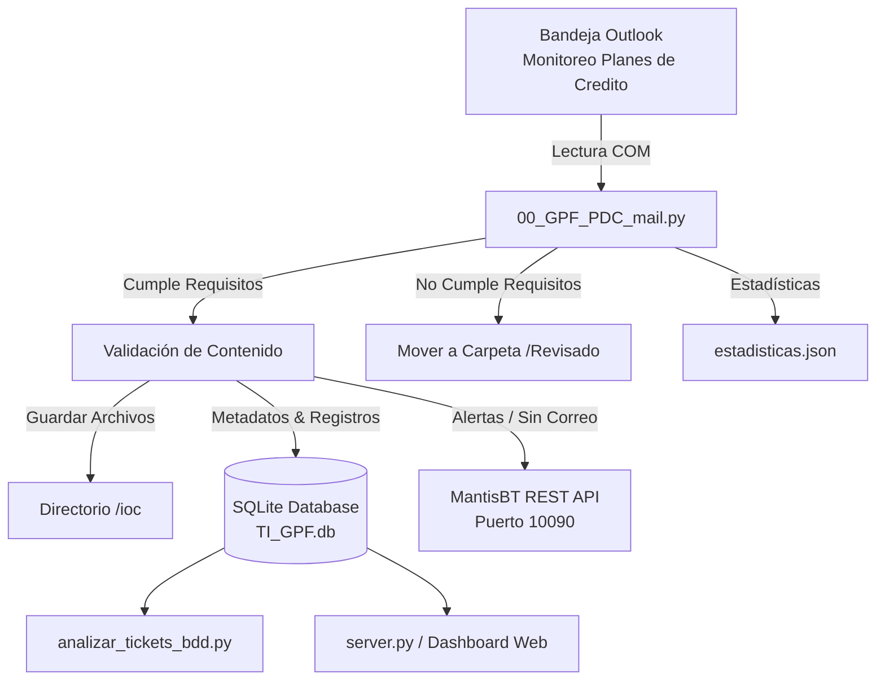

# Resumen de Ejecución del Aplicativo: Monitoreo de Planes de Crédito (GPF)

---

## 1. Visión General del Sistema

El script [`00_GPF_PDC_mail.py`](file:///c:/zabbix/python/GPF/PlanesdeCredito/00_GPF_PDC_mail.py) es una solución automatizada para el **monitoreo, ingesta de datos y gestión de alertas/tickets** de los reportes diarios de **Planes de Crédito** de Corporación GPF.

### Objetivos Clave
1. **Extracción y Procesamiento:** Leer automáticamente correos de la bandeja corporativa de Outlook de `g_automatizaciones@corporaciongpf.com` (carpeta `TI_GPF`).
2. **Ingesta de Datos:** Descargar, renombrar y persistir archivos adjuntos Excel en el directorio local `ioc/` y registrarlos en la base de datos local SQLite `TI_GPF.db`.
3. **Manejo de Requisitos y Descarte:** Si los correos no cumplen con los parámetros de asunto o adjuntos válidos, se mueven a la subcarpeta `Revisado` y se contabilizan en `estadisticas.json`.
4. **Gestión de Incidencias (MantisBT):**
   - **Ticket por anomalía de datos:** Crear tickets de prioridad **alta** si los archivos adjuntos contienen registros inválidos o datos pendientes.
   - **Ticket por falta de correo:** Detectar si un horario transcurrió sin recibir el reporte esperado y generar un ticket de tipo "SIN CORREO".
5. **Prevención de Duplicados:** Validar contra SQLite (`id_unico`) para asegurar idempotencia (evitar re-procesar correos o re-insertar registros ya existentes).

---

## 2. Arquitectura de Componentes e Integraciones

### Parámetros de Configuración Principales
- **Base de Datos SQLite:**
  - Archivo BDD: `TI_GPF.db` (en raíz del proyecto, administrado por `db.py`)
  - Esquema DDL: `schema.sql`
  - Tablas: `GPF_01_Archivos_Procesados` (Metadatos) y `GPF_01_Reporte_Diario_Tickets_Analistas` (Datos estructurados).
- **Servicio de Tickets MantisBT:**
  - Endpoint REST API: `http://172.32.1.51:10090/api/rest/issues`
  - Proyecto ID: `39` | Categoría: `General` | Prioridad: `alta`
- **Ventanas Diarias Esperadas (Horarios):**
  - **08:00** (08:00 a 08:10)
  - **12:00** (12:00 a 12:10)
  - **16:00** (16:00 a 16:10)
  - **20:00** (20:00 a 20:10)

---

## 3. Flujo de Ejecución del Script (Estructura de Pasos)

- **PASO 1: CONFIGURACIÓN Y LIBRERÍAS**
  - `PASO 1.1` - `PASO 1.7`: Carga de variables de entorno, configuración de base de datos, Outlook, MantisBT y definición de horarios esperados.
- **PASO 2: FUNCIONES DE BASE DE DATOS**
  - `PASO 2.1` (`conectar_base_datos`): Conexión a la BDD MySQL.
  - `PASO 2.2` (`almacenar_metadatos_archivo`): Inserción en `GPF_00_Archivos_Procesados`.
  - `PASO 2.3` (`almacenar_datos_del_archivo`): Inserción de filas en `GPF_00_Planesdecredito`.
  - `PASO 2.4` - `PASO 2.7`: Actualización y verificación de tickets existentes y correos por ventana.
- **PASO 3: FUNCIONES DE PROCESAMIENTO DE ADJUNTOS Y MANTISBT**
  - `PASO 3.1` (`procesar_adjunto_csv`): Almacenamiento local en `/ioc` y extracción en pandas DataFrame.
  - `PASO 3.2` (`get_operador`): Obtención del operador de turno con caché en memoria.
  - `PASO 3.3` - `PASO 3.4`: Creación de tickets en MantisBT para reportes o ausencias.
- **PASO 4: LÓGICA PRINCIPAL Y PROCESAMIENTO DE CORREOS**
  - `PASO 4.1` (`get_corresponding_window`): Cálculo de la ventana de monitoreo.
  - `PASO 4.2` (`procesar_correos_outlook`): Ciclo de lectura. Si el correo no cumple parámetros se mueve a `Leidos`; si cumple, se procesa a `PDC Procesados`.
  - `PASO 4.3` (`manejar_correo_faltante`): Creación de tickets por omisión de correo.
- **PASO 5: EJECUCIÓN PRINCIPAL (`if __name__ == "__main__":`)**
  - `PASO 5.1`: Ejecución del procesamiento de correos.
  - `PASO 5.2`: Verificación de ventanas horarias faltantes del día.

---

## 4. Resumen y Métricas de Ejecución

Según el registro persistido en [`estadisticas.json`](file:///c:/zabbix/python/GPF/PlanesdeCredito/estadisticas.json):

| Métrica | Valor | Descripción / Estado |
| :--- | :---: | :--- |
| **Correos Totales Detectados** | `20` | Cantidad total de correos en la carpeta de monitoreo |
| **Correos Pre-creados / Pre-analizados** | `20` | Correos evaluados por el flujo de control de tiempos |
| **Correos Almacenados con Éxito** | `0` | Correos procesados con datos en la última corrida activa |
| **Correos No Almacenados (Vacíos/Error)** | `0` | Correos omitidos por falla o ausencia de registros |
| **Correos Almacenados - No Cumple con Requisitos** | `0` | Correos movidos a la carpeta `Leidos` por no cumplir parámetros |
| **Alarmas / Tickets Creados** | `0` | Incidencias enviadas a MantisBT durante la corrida |

---

## 5. Estructura del Proyecto

- [`00_GPF_PDC_mail.py`](file:///c:/Users/g_automatizaciones/Documents/TIGPF/TIGPF/01_Tickets_TIGPF/00_GPF_PDC_mail.py): Script ejecutable principal de ingesta desde Outlook hacia SQLite.
- [`schema.sql`](file:///c:/Users/g_automatizaciones/Documents/TIGPF/TIGPF/01_Tickets_TIGPF/schema.sql): Esquema DDL de creación de tablas e índices para SQLite.
- [`db.py`](file:///c:/Users/g_automatizaciones/Documents/TIGPF/TIGPF/01_Tickets_TIGPF/db.py): Módulo centralizado de conexión y compatibilidad SQLite.
- [`TI_GPF.db`](file:///c:/Users/g_automatizaciones/Documents/TIGPF/TIGPF/01_Tickets_TIGPF/TI_GPF.db): Base de datos relacional local en SQLite.
- [`02_Analizador_Tickets_TIGPF/`](file:///c:/Users/g_automatizaciones/Documents/TIGPF/TIGPF/01_Tickets_TIGPF/02_Analizador_Tickets_TIGPF): Módulo de análisis (`analizar_tickets_bdd.py`) y servidor web/API REST (`server.py`).
- [`ioc/`](file:///c:/Users/g_automatizaciones/Documents/TIGPF/TIGPF/01_Tickets_TIGPF/ioc): Carpeta de almacenamiento permanente de archivos adjuntos Excel.
- [`requirements.txt`](file:///c:/Users/g_automatizaciones/Documents/TIGPF/TIGPF/01_Tickets_TIGPF/requirements.txt): Archivo de dependencias de Python.
- [`readme.md`](file:///c:/Users/g_automatizaciones/Documents/TIGPF/TIGPF/01_Tickets_TIGPF/readme.md): Documentación del resumen de ejecución del aplicativo.
